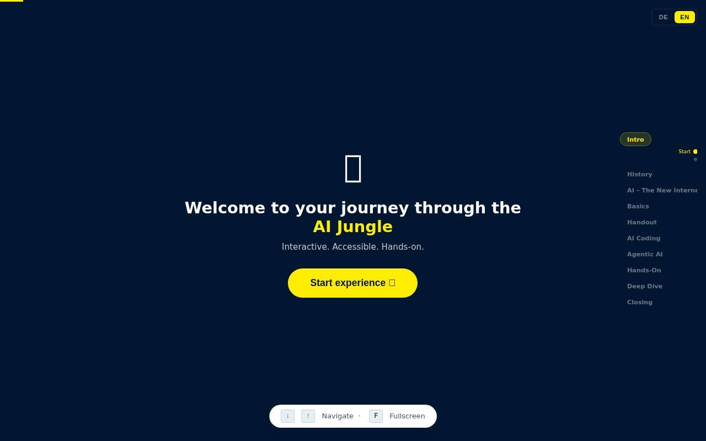
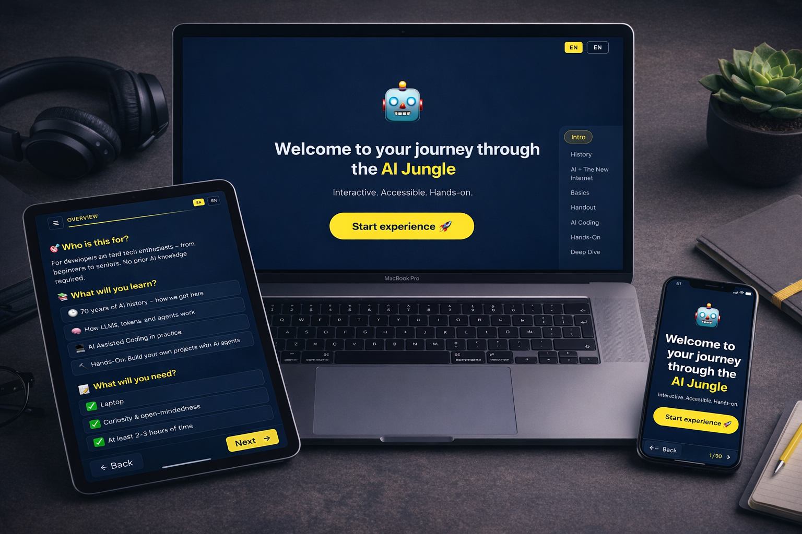

#  Agentic AI Workshop

> **English Readme below**

Eine interaktive Web-Präsentation und Self-Guided Workshop zum Thema **AI Agents, LLMs und AI-Assisted Coding**. Entstanden während meiner Arbeits- & Freizeit für https://github.com/HUK-COBURG als Mehrwert für meine Gruppe & alle, die das Thema KI interessiert.

**[agentic-ai.weisser.dev](https://agentic-ai.weisser.dev)** – direkt im Browser starten.




---

## Was ist das?

Dieses Projekt ist beides:

- **Live-Präsentation** – Fullscreen-Slides mit Scroll-Snap, Timer, Konfetti und Presenter Mode für Workshops und Vorträge
- **Self-Guided Workshop** – Interaktive Experience mit Quizzes, Copy-Buttons und Schritt-für-Schritt Hands-On Anleitungen zum Selbstlernen

Die gesamte Präsentation wurde mit **[OpenCode](https://opencode.ai)** erstellt – sie ist ihr eigenes Beispiel.

## Für wen?

- Entwickler die verstehen wollen, wie AI Agents funktionieren
- Technik-Interessierte ohne KI-Vorwissen
- Teams die einen Workshop zu AI-Assisted Coding durchführen wollen
- Alle die wissen wollen, was hinter LLMs, Tokens, Kontext und MCP steckt

## Was lernt man?

### Geschichte & Status Quo
- 70 Jahre KI-Geschichte: von 1956 bis 2026
- Was bedeutet GPT? (Generative Pre-trained Transformer)
- Warum lernt die KI nicht aus meinen Fragen? (Training vs. Inference)
- Die Big 6 (OpenAI, Anthropic, Google, Meta, xAI, Alibaba/Qwen)
- Benchmarks, Preise, GPU vs Token APIs
- AGI und der Intelligence Index

### KI – Das neue Internet
- Kreative KI: Video, Bilder, Gefahren
- Vom ChatBot zum Agenten
- MCP (Model Context Protocol) als offener Standard
- Reale Beispiele: Automatisierung, No-Backend, eigene Agents
- Risiken und Kosten ($82k-Story)

### Die Basics
- Wie LLMs denken: Tokenisierung, Embeddings, Attention
- Wie lernt ein neuronales Netz? (Spam-Erkennungs-Beispiel)
- Warum KI manchmal „dumm" antwortet (Waschanlage-Problem, Common Sense)
- Was sind Tokens und warum sind sie wichtig
- Kontext-Fenster und Komprimierung
- AGENTS.md – das Regelwerk für deinen Agent
- Sub-Agents: Theorie und Praxis
- Realitätscheck: ROI, Fragilität, Human-in-the-Loop

### AI Assisted Coding
- Evolution: von Copilot zu Agentic Development
- Tool-Zoo: 16 aktuelle Tools im Vergleich
- Vibe Coding vs. Spec-Driven Development
- Agent-Driven vs. Spec-Driven im Vergleich

### Agentic AI (NEU)
- Was ist Agentic AI? (Definition, Single vs. Multi-Agent, Backend vs. Frontend Agents)
- Layer-Modelle im Vergleich (Boomi, Vendia LAMP, Mezmo/AURA, Workshop-Modell)
- Agentic Architecture Deep Dive (2-Spalten: Mit User Input vs. 100% Automatisierung)
- **Interaktiver Architecture Builder** mit 11 Use-Case-Presets als Mermaid.js-Diagramme
  - Lokal: Coding Assistant, Doku-Agent
  - Remote: Code Review, Kunden-Chatbot, Voice Agent, Ticket-Automatisierung, Wissens-Agent, Data Pipeline
  - Headless: CVE Auto-Patching, Anomalie-Erkennung, Tägliche System-Prüfung
- 3 Wege: Selbst bauen / Agent baut / Agent IST das Backend
- Sind Agenten resilient? (Determinismus, Model-Updates, fachliche Tests, Monitoring)

### Hands-On
- Warum npm? Was ist Node.js? (Vergleich mit Java/Python)
- Was ist Vite? (Build-Tool, Hot Reload, kostenloses Hosting)
- Terminal, Dev-Server & Chrome Dev Tools (Typische Stolpersteine)
- Schritt-für-Schritt Setup: Node.js, OpenCode, VS Code, Bedrock (3 Optionen: Workshop, Enterprise, Privat)
- Spiele bauen: 2048, Doodle Jump, Space Invaders
- AGENTS.md schreiben und verbessern lassen

### Deep Dive
- MCP verbinden (Playwright MCP Tutorial)
- Sub-Agents bauen (OpenCode Agents + OpenAgentsControl)
- OpenCode Web als lokales ChatGPT
- Custom Commands (`/review`, `/test`, `/docs`)
- Agent Skills

## Features

### Präsentation
- Fullscreen Slides mit Scroll-Snap (Desktop)
- Rechte Sidebar-Navigation mit Section Labels und Sub-Dots
- Adaptive Farben (Hell/Dunkel je nach Slide-Hintergrund)
- Keyboard-Navigation (Pfeiltasten, F für Fullscreen)
- URL-Hash für Slide-Persistenz
- Instant-Jump bei großer Distanz, Smooth bei Nachbar-Slides
- Sprachauswahl DE/EN mit automatischer Browser-Erkennung

### Presenter Mode
- Aktivieren: `?presenter` URL-Parameter oder `P`-Taste (Hidden Feature)
- Willkommens-Slide mit Organisatorischem
- Check-In Runde (KI-Erfahrung der Teilnehmer)
- 20-Minuten Pause-Timer mit Konfetti-Overlay
- 15-Minuten Diskussionsrunde mit Verlängern/Fortfahren
- Feedback-Runde am Ende
- Quiz-Slides auf Desktop ausgeblendet

### Self-Paced Mode (Standard)
- „Experience starten" Einstieg
- Quiz-Slides sichtbar (Wissens-Checks nach jedem Kapitel)
- Kein Timer, keine Pause-Slides
- Handout als reines Nachschlagewerk

### Mobile
- App-Mode mit Progress Bar, Burger-Menü, Prev/Next Buttons
- Touch-Swipe Navigation (ignoriert Swipes in scrollbaren Elementen)
- Horizontale Tabellen-Scrollung (kein Word-Break bei Tabellenzellen)
- Eigene Onboarding-Slides (Für wen? Was lernst du? Was brauchst du?)
- Quiz-Slides zwischen Kapiteln
- Alle Layouts stacken zu einer Spalte

### Progression
- Aktueller Slide wird bei jedem Wechsel in `localStorage` gespeichert
- Beim Öffnen ohne URL-Hash: „Willkommen zurück"-Modal mit Fortschrittsbalken
- Optionen: **Weitermachen** oder **Neu beginnen**
- State verfällt nach 7 Tagen

### Architecture Builder
- **11 Use-Case-Presets** als interaktive Mermaid.js-Flowcharts
- Deployment-Zonen (Lokal, On-Prem, AWS, Azure, SaaS) als farbige Subgraphs
- User-Akteure in allen Diagrammen (Entwickler, Kunde, Mitarbeiter, Admin, Cron)
- Bidirektionale Pfeile mit beschreibenden Labels
- PNG-Export mit Watermark (`agentic-ai.weisser.dev`)
- Link-Sharing mit URL-Parameter (`?uc=voice#arch-builder`)
- Deep-Linking: URL-Parameter lädt Use Case automatisch
- Nur auf Desktop sichtbar, Mobile zeigt Hinweis

### Tastenkürzel

| Taste | Funktion |
|---|---|
| `↓` `→` `Space` `PageDown` | Nächste Slide |
| `↑` `←` `PageUp` | Vorherige Slide |
| `Home` | Erste Slide |
| `End` | Letzte Slide |
| `F` | Fullscreen an/aus |
| `P` | Presenter Mode an/aus (Hidden Feature) |

## Tech Stack

- **[Vite](https://vitejs.dev/)** 5 – Build Tool
- **Vanilla JS** – Kein Framework
- **[Mermaid.js](https://mermaid.js.org/)** – Architektur-Diagramme (SVG)
- **CSS** – Custom Design System (Teal/Yellow/Navy)
- **HTML** – Template Literals in JS-Modulen
- **[Playwright](https://playwright.dev/)** – Mobile Audit (Dev-Dependency)

## Projektstruktur

```
src/
  main.js                       # Navigation, Timer, i18n, Mobile, Quiz, Arch Builder, Progression
  style.css                     # Design System, Layouts, Responsive, Mobile
  sections/
    de/                         # Deutsche Slides
      01-intro.js ... 06c-agentic.js ... 09-abschluss.js
    en/                         # English Slides
      01-intro.js ... 06c-agentic.js ... 09-abschluss.js
index.html                      # HTML-Shell mit Favicon
public/
  favicon/                      # Custom Favicons
CHANGELOG.md                    # Alle Releases dokumentiert
```

## Lokal starten

```bash
npm install
npm run dev
```

Öffnet `http://localhost:5173` im Browser.

### Presenter Mode testen

```
http://localhost:5173/?presenter
```

### Timer verkürzen (Debug)

```
http://localhost:5173/?presenter&timer=30
```

### Sprache erzwingen

```
http://localhost:5173/?lang=en
```

## Deployment

```bash
npm run build
```

Erzeugt `dist/` – statische Dateien, hostbar auf jedem Webserver.

Aktuell deployed auf: **[agentic-ai.weisser.dev](https://agentic-ai.weisser.dev)**

## Quellen & Credits

| Ressource | Verwendung | Lizenz / Link |
|---|---|---|
| [OpenCode](https://opencode.ai) | AI Coding Agent (Erstellung dieser Präsentation) | Open Source |
| [Anthropic Claude](https://www.anthropic.com) | LLM (Claude via Amazon Bedrock) | Commercial |
| [Vite](https://vitejs.dev/) | Build Tool | MIT |
| [Continue](https://continue.dev) | IDE-Plugin Referenz | Apache 2.0 |
| [Open WebUI](https://openwebui.com) | Self-hosted Chat Referenz | MIT |
| [Playwright MCP](https://github.com/microsoft/playwright-mcp) | Deep Dive Tutorial-Referenz | Apache 2.0 |
| [OpenAgentsControl](https://github.com/darrenhinde/OpenAgentsControl) | Sub-Agent Framework Referenz | Open Source |
| [awesome-claude-code-subagents](https://github.com/VoltAgent/awesome-claude-code-subagents) | Sub-Agent Beispielsammlung | Open Source |
| [remote-opencode-telegram](https://github.com/weisser-dev/remote-opencode-telegram) | OpenCode per Telegram bedienen (Fork, selbst gebaut) | MIT |
| [HUK-Coburg GitHub](https://github.com/huk-coburg) | Praxisbeispiel KI-Agents in Produktion | Public |
| [artificialanalysis.ai](https://artificialanalysis.ai) | Live Benchmark Iframe | Public |
| [trackingai.org](https://www.trackingai.org/home) | Historische KI-IQ Entwicklung (GIF) | Public |
| [qrserver.com](https://goqr.me/api/) | QR-Code Generierung | Free API |
| [YouTube](https://youtube.com) | Will Smith Spaghetti Video Embed | YouTube ToS |
| [agents.md](https://agents.md) | AGENTS.md Konzept | Open Source |
| [MCP Spec](https://modelcontextprotocol.io) | Model Context Protocol | Open Source |
| [agidefinition.ai](https://www.agidefinition.ai/) | AGI Definition Referenz | Public |
| [GitHub Blog](https://github.blog/news-insights/research/survey-reveals-ais-impact-on-the-developer-experience/) | AI Impact on Developer Experience | Public |
| [a16z](https://a16z.com/navigating-the-high-cost-of-ai-compute/) | High Cost of AI Compute | Public |
| [Business Insider](https://www.businessinsider.de/wirtschaft/international-business/klarna-entlaesst-haelfte-der-mitarbeiter-wegen-ki/) | Klarna & KI | Public |
| [FAZ](https://www.faz.net/aktuell/feuilleton/medien-und-film/medienpolitik/grok-erzeugt-weiter-sexualisierte-bilder-200502477.html) | Grok Content Filter | Public |
| [NDR](https://www.ndr.de/kultur/ki-agenten-unter-sich-welche-gefahren-hinter-moltbook-stecken,moltbook-100.html) | Moltbook-Gefahren | Public |
| [GenAI Newsletter](https://newsletter.genai.works/p/cursor-s-new-model-beats-claude-and-costs-86-less) | Cursor schlägt Claude & GPT-5 | Public |
| [Reddit/singularity](https://www.reddit.com/r/singularity/comments/1ryrs2w/cursors_composer_2_model_is_apparently_just_kimi/) | Cursor = Kimi k2.5 Diskussion | Public |
| [OpenClaw](https://openclaw.ai) | KI-Lizenz-Tool Referenz | Public |
| [Moltbook](https://www.moltbook.com) | KI-Agenten-Gefahren Beispiel | Public |
| [Kiro](https://kiro.dev) | AWS Kiro IDE (Spec-Driven Development) | Public |
| [Roo Code](https://github.com/RooCodeInc/Roo-Code) | AI Coding Tool Referenz | Open Source |
| [Claude Code Docs](https://code.claude.com/docs/en/sub-agents) | Sub-Agents Dokumentation | Public |
| [Pragmatic Engineer](https://blog.pragmaticengineer.com/stack-overflow-is-almost-dead/) | Stack Overflow Rückgang | Public |
| [Heise](https://www.heise.de/hintergrund/Hat-KI-bereits-eine-Art-Bewusstsein-entwickelt-Forscher-streiten-darueber-6522868.html) | KI-Bewusstsein Debatte | Public |
| [Tenet Blog](https://www.wearetenet.com/blog/github-copilot-usage-data-statistics) | GitHub Copilot Nutzungsdaten | Public |
| [WinFuture](https://winfuture.de/news,155972.html) | Stack Overflow Traffic-Rückgang | Public |
| [Futurism](https://futurism.com/artificial-intelligence/sam-altman-thanks-programmers-over) | Sam Altman zu Programmierern | Public |
| [Capital](https://www.capital.de/wirtschaft-politik/trump-gegen-ki-giganten--wer-regiert-die-welt-in-zukunft--37225614.html) | Trump vs. KI-Giganten | Public |
| [Anthropic Blog](https://www.anthropic.com/news/detecting-and-preventing-distillation-attacks) | Distillation Attacks Report | Public |
| [CosmicJS](https://www.cosmicjs.com/blog/claude-sonnet-45-vs-opus-45-a-real-world-comparison) | Claude Sonnet vs. Opus Vergleich | Public |
| [AWS Bedrock Docs](https://docs.aws.amazon.com/decision-guides/latest/bedrock-or-sagemaker/bedrock-or-sagemaker.html) | Bedrock vs. SageMaker Guide | Public |
| [Dataiku](https://www.dataiku.com/stories/detail/ai-agents/) | Understanding AI Agents & Agentic Workflows | Public |
| [Vectorize](https://vectorize.io/blog/designing-agentic-ai-systems-part-1-agent-architectures) | Designing Agentic AI Systems | Public |
| [Blog: Cloudflare Pages](https://blog.weisser.dev/blog/2026/03/24/frontend-hosting-cloudflare-pages/) | Frontend Hosting Anleitung | Public |
| [Blog: OpenCode Telegram](https://blog.weisser.dev/projects/ai/2026/03/24/opencode-remote-telegram.html) | OpenCode Remote Telegram | Public |
| [Mermaid.js](https://mermaid.js.org/) | Diagramm-Rendering Engine | MIT |

## Meta

Diese Präsentation wurde vollständig mit **[OpenCode](https://opencode.ai)** erstellt – einem Open-Source AI Coding Agent. Sie nutzt Claude über Amazon Bedrock und ist damit ihr eigenes bestes Beispiel für AI-Assisted Development.

### Deep Dive 6: remote-opencode-telegram

Der Workshop enthält einen Bonus Deep Dive über [`remote-opencode-telegram`](https://github.com/weisser-dev/remote-opencode-telegram) — ein Fork des Discord-Bots, der um vollständigen Telegram-Support erweitert wurde. Als Beispiel für AI-Assisted Development: in ~1 Stunde mit OpenCode gebaut.

**Setup (einmalig):**

```bash
git clone https://github.com/weisser-dev/remote-opencode-telegram.git
cd remote-opencode-telegram && npm install && npm run build && npm link

remote-opencode configure    # Bot-Token, Projekte, Modell konfigurieren
remote-opencode telegram start
```

**Vibe Coding Flow in Telegram:**

```
/sps           → Projekt wählen (/sp1, /sp2 — ein Tap)
/lm            → Modell wählen (/sm1, /sm2 — ein Tap)
/vibe_coding   → Session starten
"fix the bug"  → einfach tippen, kein /command nötig
/stop_coding   → Session beenden
```

## Lizenz

© 2026 [weisser-dev](https://github.com/weisser-dev)

---

#  Agentic AI Workshop (English)

An interactive web presentation and self-guided workshop about **AI Agents, LLMs and AI-Assisted Coding**.

**[agentic-ai.weisser.dev](https://agentic-ai.weisser.dev)** – start directly in the browser.



---

## What is this?

This project is both:

- **Live Presentation** – Fullscreen slides with scroll-snap, timers, confetti and presenter mode for workshops and talks
- **Self-Guided Workshop** – Interactive experience with quizzes, copy buttons and step-by-step hands-on tutorials for self-paced learning

The entire presentation was built with **[OpenCode](https://opencode.ai)** – it is its own example.

## Who is it for?

- Developers who want to understand how AI Agents work
- Tech-interested people with no prior AI knowledge
- Teams looking to run an AI-Assisted Coding workshop
- Anyone who wants to know what's behind LLMs, tokens, context and MCP

## What will you learn?

### History & Status Quo
- 70 years of AI history: from 1956 to 2026
- What does GPT mean? (Generative Pre-trained Transformer)
- Why doesn't AI learn from my questions? (Training vs. Inference)
- The Big 6 (OpenAI, Anthropic, Google, Meta, xAI, Alibaba/Qwen)
- Benchmarks, pricing, GPU vs token APIs
- AGI and the Intelligence Index

### AI – The New Internet
- Creative AI: video, images, dangers
- From chatbot to agent
- MCP (Model Context Protocol) as open standard
- Real examples: automation, no-backend, custom agents
- Risks and costs ($82k story)

### The Basics
- How LLMs think: tokenization, embeddings, attention
- How does a neural network learn? (Spam detection example)
- Why AI sometimes gives "dumb" answers (Car wash problem, Common Sense)
- What are tokens and why they matter
- Context window and compression
- AGENTS.md – the rulebook for your agent
- Sub-agents: theory and practice
- Reality check: ROI, fragility, human-in-the-loop

### AI Assisted Coding
- Evolution: from Copilot to agentic development
- Tool zoo: 16 current tools compared
- Vibe Coding vs. Spec-Driven Development
- Agent-driven vs. spec-driven comparison

### Agentic AI (NEW)
- What is Agentic AI? (Definition, Single vs. Multi-Agent, Backend vs. Frontend Agents)
- Layer models compared (Boomi, Vendia LAMP, Mezmo/AURA, Workshop model)
- Agentic Architecture Deep Dive (2-column: With User Input vs. 100% Automation)
- **Interactive Architecture Builder** with 11 use-case presets as Mermaid.js diagrams
  - Local: Coding Assistant, Docs Agent
  - Remote: Code Review, Customer Chatbot, Voice Agent, Ticket Automation, Knowledge Agent, Data Pipeline
  - Headless: CVE Auto-Patching, Anomaly Detection, Daily System Health Check
- 3 Paths: Build Yourself / Agent Builds / Agent IS the Backend
- Are Agents Resilient? (Determinism, model updates, functional tests, monitoring)

### Hands-On
- Why npm? What is Node.js? (Comparison with Java/Python)
- What is Vite? (Build tool, hot reload, free hosting)
- Terminal, Dev Server & Chrome Dev Tools (Common pitfalls)
- Step-by-step setup: Node.js, OpenCode, VS Code, Bedrock (3 options: Workshop, Enterprise, Private)
- Build games: 2048, Doodle Jump, Space Invaders
- Write and improve AGENTS.md

### Deep Dive
- Connect MCP (Playwright MCP tutorial)
- Build sub-agents (OpenCode Agents + OpenAgentsControl)
- OpenCode Web as local ChatGPT
- Custom commands (`/review`, `/test`, `/docs`)
- Agent skills

## Features

### Presentation
- Fullscreen slides with scroll-snap (desktop)
- Right sidebar navigation with section labels and sub-dots
- Adaptive colors (light/dark based on slide background)
- Keyboard navigation (arrow keys, F for fullscreen)
- URL hash for slide persistence
- Instant jump for far distances, smooth for nearby slides
- Language selector DE/EN with automatic browser detection

### Presenter Mode
- Activate: `?presenter` URL parameter or `P` key (hidden feature)
- Welcome slide with logistics
- Check-in round (participants' AI experience)
- 20-minute break timer with confetti overlay
- 15-minute discussion round with extend/continue
- Feedback round at the end
- Quiz slides hidden on desktop

### Self-Paced Mode (Default)
- "Start Experience" entry
- Quiz slides visible (knowledge checks after each chapter)
- No timer, no break slides
- Handout as pure reference

### Mobile
- App mode with progress bar, burger menu, prev/next buttons
- Touch swipe navigation (ignores swipes inside scrollable elements)
- Horizontal table scrolling (no word-break in table cells)
- Custom onboarding slides (Who? What? Requirements?)
- Quiz slides between chapters
- All layouts stack to single column

### Progression
- Current slide saved to `localStorage` on every change
- On reload without URL hash: "Welcome back" modal with progress bar
- Options: **Continue** or **Start over**
- State expires after 7 days

### Architecture Builder
- **11 use-case presets** as interactive Mermaid.js flowcharts
- Deployment zones (Local, On-Prem, AWS, Azure, SaaS) as colored subgraphs
- User actors in all diagrams (Developer, Customer, Employee, Admin, Cron)
- Bidirectional arrows with descriptive labels
- PNG export with watermark (`agentic-ai.weisser.dev`)
- Link sharing with URL parameter (`?uc=voice#arch-builder`)
- Deep-linking: URL parameter auto-loads use case
- Desktop only, mobile shows hint

### Keyboard Shortcuts

| Key | Function |
|---|---|
| `↓` `→` `Space` `PageDown` | Next slide |
| `↑` `←` `PageUp` | Previous slide |
| `Home` | First slide |
| `End` | Last slide |
| `F` | Toggle fullscreen |
| `P` | Toggle presenter mode (hidden feature) |

## Tech Stack

- **[Vite](https://vitejs.dev/)** 5 – Build tool
- **Vanilla JS** – No framework
- **[Mermaid.js](https://mermaid.js.org/)** – Architecture diagrams (SVG)
- **CSS** – Custom design system (Teal/Yellow/Navy)
- **HTML** – Template literals in JS modules
- **[Playwright](https://playwright.dev/)** – Mobile audit (dev dependency)

## Run locally

```bash
npm install
npm run dev
```

Opens `http://localhost:5173` in the browser.

### Test presenter mode

```
http://localhost:5173/?presenter
```

### Shorten timers (debug)

```
http://localhost:5173/?presenter&timer=30
```

### Force language

```
http://localhost:5173/?lang=en
```

## Deployment

```bash
npm run build
```

Creates `dist/` – static files, hostable on any web server.

Currently deployed at: **[agentic-ai.weisser.dev](https://agentic-ai.weisser.dev)**

## Sources & Credits

| Resource | Usage | License / Link |
|---|---|---|
| [OpenCode](https://opencode.ai) | AI Coding Agent (built this presentation) | Open Source |
| [Anthropic Claude](https://www.anthropic.com) | LLM (Claude via Amazon Bedrock) | Commercial |
| [Vite](https://vitejs.dev/) | Build tool | MIT |
| [Continue](https://continue.dev) | IDE plugin reference | Apache 2.0 |
| [Open WebUI](https://openwebui.com) | Self-hosted chat reference | MIT |
| [Playwright MCP](https://github.com/microsoft/playwright-mcp) | Deep dive tutorial reference | Apache 2.0 |
| [OpenAgentsControl](https://github.com/darrenhinde/OpenAgentsControl) | Sub-agent framework reference | Open Source |
| [awesome-claude-code-subagents](https://github.com/VoltAgent/awesome-claude-code-subagents) | Sub-agent examples collection | Open Source |
| [remote-opencode-telegram](https://github.com/weisser-dev/remote-opencode-telegram) | Control OpenCode via Telegram (fork, self-built) | MIT |
| [HUK-Coburg GitHub](https://github.com/huk-coburg) | Real-world AI agents in production | Public |
| [artificialanalysis.ai](https://artificialanalysis.ai) | Live benchmark iframe | Public |
| [trackingai.org](https://www.trackingai.org/home) | Historical AI IQ development (GIF) | Public |
| [qrserver.com](https://goqr.me/api/) | QR code generation | Free API |
| [YouTube](https://youtube.com) | Will Smith Spaghetti video embed | YouTube ToS |
| [agents.md](https://agents.md) | AGENTS.md concept | Open Source |
| [MCP Spec](https://modelcontextprotocol.io) | Model Context Protocol | Open Source |
| [agidefinition.ai](https://www.agidefinition.ai/) | AGI definition reference | Public |
| [GitHub Blog](https://github.blog/news-insights/research/survey-reveals-ais-impact-on-the-developer-experience/) | AI Impact on Developer Experience | Public |
| [a16z](https://a16z.com/navigating-the-high-cost-of-ai-compute/) | High Cost of AI Compute | Public |
| [Business Insider](https://www.businessinsider.de/wirtschaft/international-business/klarna-entlaesst-haelfte-der-mitarbeiter-wegen-ki/) | Klarna & AI | Public |
| [FAZ](https://www.faz.net/aktuell/feuilleton/medien-und-film/medienpolitik/grok-erzeugt-weiter-sexualisierte-bilder-200502477.html) | Grok content filter | Public |
| [NDR](https://www.ndr.de/kultur/ki-agenten-unter-sich-welche-gefahren-hinter-moltbook-stecken,moltbook-100.html) | Moltbook dangers | Public |
| [GenAI Newsletter](https://newsletter.genai.works/p/cursor-s-new-model-beats-claude-and-costs-86-less) | Cursor beats Claude & GPT-5 | Public |
| [Reddit/singularity](https://www.reddit.com/r/singularity/comments/1ryrs2w/cursors_composer_2_model_is_apparently_just_kimi/) | Cursor = Kimi k2.5 discussion | Public |
| [OpenClaw](https://openclaw.ai) | AI licensing tool reference | Public |
| [Moltbook](https://www.moltbook.com) | AI agent dangers example | Public |
| [Kiro](https://kiro.dev) | AWS Kiro IDE (Spec-Driven Development) | Public |
| [Roo Code](https://github.com/RooCodeInc/Roo-Code) | AI coding tool reference | Open Source |
| [Claude Code Docs](https://code.claude.com/docs/en/sub-agents) | Sub-agents documentation | Public |
| [Pragmatic Engineer](https://blog.pragmaticengineer.com/stack-overflow-is-almost-dead/) | Stack Overflow decline | Public |
| [Heise](https://www.heise.de/hintergrund/Hat-KI-bereits-eine-Art-Bewusstsein-entwickelt-Forscher-streiten-darueber-6522868.html) | AI consciousness debate | Public |
| [Tenet Blog](https://www.wearetenet.com/blog/github-copilot-usage-data-statistics) | GitHub Copilot usage data | Public |
| [WinFuture](https://winfuture.de/news,155972.html) | Stack Overflow traffic decline | Public |
| [Futurism](https://futurism.com/artificial-intelligence/sam-altman-thanks-programmers-over) | Sam Altman on programmers | Public |
| [Capital](https://www.capital.de/wirtschaft-politik/trump-gegen-ki-giganten--wer-regiert-die-welt-in-zukunft--37225614.html) | Trump vs. AI giants | Public |
| [Anthropic Blog](https://www.anthropic.com/news/detecting-and-preventing-distillation-attacks) | Distillation attacks report | Public |
| [CosmicJS](https://www.cosmicjs.com/blog/claude-sonnet-45-vs-opus-45-a-real-world-comparison) | Claude Sonnet vs. Opus comparison | Public |
| [AWS Bedrock Docs](https://docs.aws.amazon.com/decision-guides/latest/bedrock-or-sagemaker/bedrock-or-sagemaker.html) | Bedrock vs. SageMaker guide | Public |
| [Dataiku](https://www.dataiku.com/stories/detail/ai-agents/) | Understanding AI Agents & Agentic Workflows | Public |
| [Vectorize](https://vectorize.io/blog/designing-agentic-ai-systems-part-1-agent-architectures) | Designing Agentic AI Systems | Public |
| [Blog: Cloudflare Pages](https://blog.weisser.dev/blog/2026/03/24/frontend-hosting-cloudflare-pages/) | Frontend hosting guide | Public |
| [Blog: OpenCode Telegram](https://blog.weisser.dev/projects/ai/2026/03/24/opencode-remote-telegram.html) | OpenCode Remote Telegram | Public |
| [Mermaid.js](https://mermaid.js.org/) | Diagram rendering engine | MIT |

## Meta

This presentation was built entirely with **[OpenCode](https://opencode.ai)** – an open-source AI coding agent. It uses Claude via Amazon Bedrock, making it its own best example of AI-assisted development.

## License

© 2026 [weisser-dev](https://github.com/weisser-dev)
